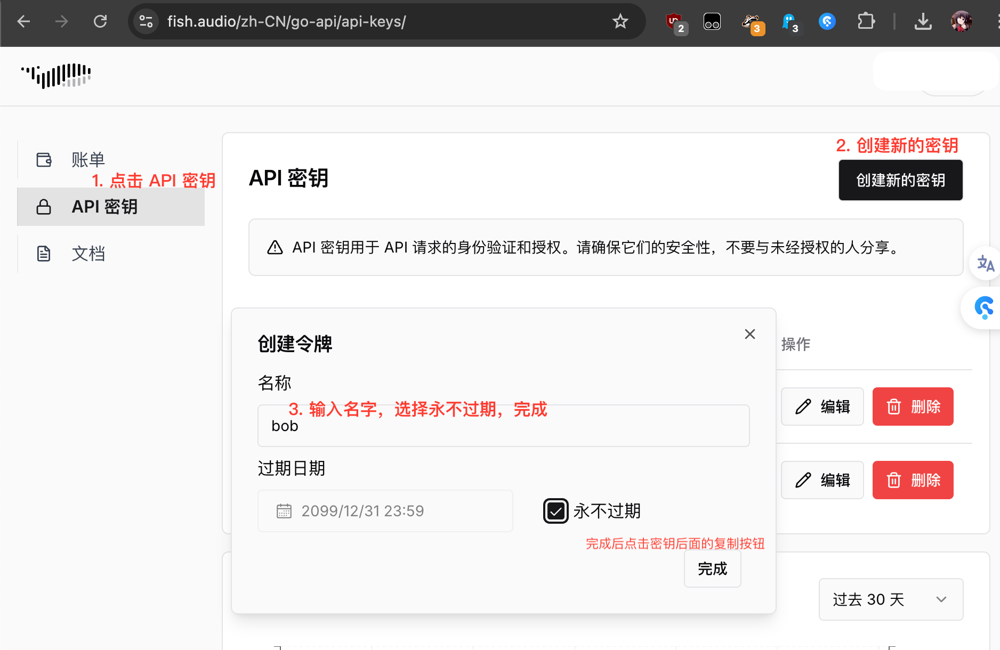
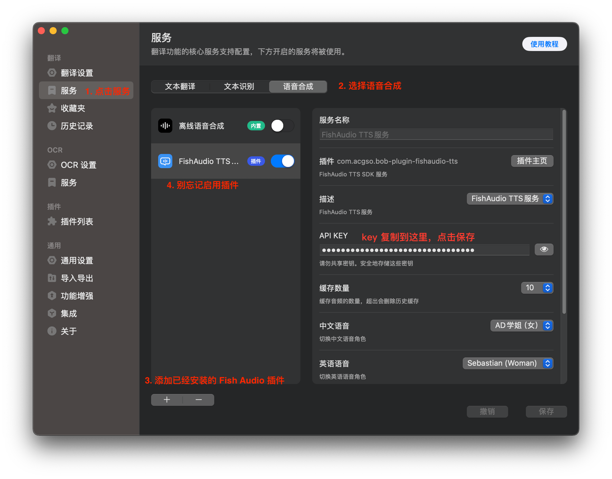

# bob-plugin-fishaudio-tts

这是一个插件，用于将文本转换为语音，并播放音频。

你需要 [API KEY](https://fish.audio/zh-CN/go-api/api-keys/) 才能使用这个插件，好消息是 API 有免费额度可以使用。

## 使用方法

1. 下载插件，双击插件安装插件。接下来需要获取 API KEY 和设置 API KEY。

2. 打开 https://fish.audio/zh-CN/go-api/api-keys/ 获取 API KEY。

3. 打开 bob 的设置，在 `API KEY` 中输入 API KEY。

